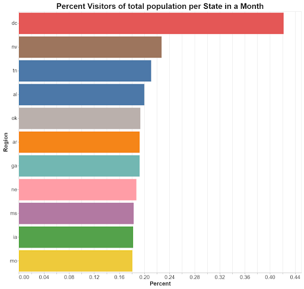

# Proposal: Analytical Success

Presented by: *Kai Matkin - CS, Erik Sanders - CS, Blake Krupa - DS, & Allison Day - DS*

---
### Buisness Needs:
**Idea:** 
>Analyze larger companies and pick out key values that lead to their success. (i.e. location, traffic patterns, ideal brand "shoppers" to target) Present unsupervised model to smaller buisnesses.

**Requirements:**
- Data analyzing 3-5 companies in a specific market
- Big data platform to work the data with
- Additional data outside of Safegraph

### Safegraph Data:
**Findings:**
(*NEEDS TO BE UPDATED*)

### Other Data:

> From initial findings, we felt additional data from the census could be helpful. Just an understanding of the percent from a given state or census group could provide valuable insight into the success of the bank. 
It could also be interesting to pull COVID data and look for any trends that could help our model make predictions. 
Weather conditions might be another indicator of foot traffic in store, and using conditions from specific areas might be helpful. 
Exploring any trends between gas prices and foot traffic could be another area.
General indicators from dataframes on how well the economy and stock market is doing has the potential to be the most helpful in predicting success of the banking business. 

### Success: 

**Main Point:** Find key indicators to larger companies success and present them to smaller companies.

**Deliverables:**
- ML Model to pick out key indicators to success. (unsupervised/semi-supervised learning)
- Create a graph to show the popularity of a market by region (Rural vs City)
- Is the given market more popular in multiple regions?
- Charts to demonstrate the effectiveness of the markets buildings
- Using median time and visitor count to show if a new building needs to be built in specific area.
